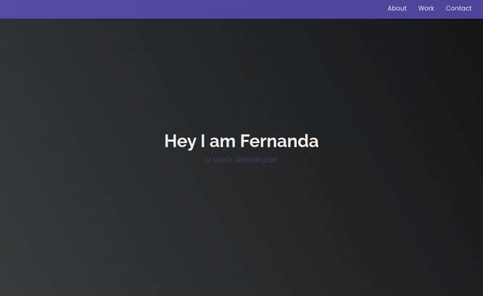

<h1 align="center"> My projects for this certification </h1>  

  Developed with HTML and CSS |
  Repository created to show all my exercises and projects developed for the freecodecamp Responsive Web Design certification.

## Introduction

Below is the last project that consisted of a personal portfolio page, in which I show some of the projects developed during the course.

**Web version**

  

**Mobile version**

  

## Exercises and Projects

These are the exercises and projects I did for the certification.:

### HTML by Building a Cat Photo App

HTML tags give a webpage its structure. We can use HTML tags to add photos, buttons, and other elements.

In this course, I learned the most common HTML tags by creating a cat photo application.

  

(<a href="#readme-top">back to top</a>)

### Basic CSS by Building a Cafe Menu
CSS tells the browser how to display a webpage. We can use CSS to set the color, font, size, and other aspects of HTML elements.

In this course, I learned CSS by designing a menu page for a cafe webpage.

  

(<a href="#readme-top">back to top</a>)

### CSS Colors by Building a Set of Colored Markers

In this course, I built a set of colored markers. I practiced different ways of setting core values ​​and how to pair cores with each other.

  

(<a href="#readme-top">back to top</a>)

### HTML Forms by Building a Registration Form

In this course, build HTML forms by creating a sign-up page. Learn how to control what types of data people can type into a form and some new CSS tools for styling pages.

  

(<a href="#readme-top">back to top</a>)

### Survey Form

I built a survey form to collect data from users.

  

(<a href="#readme-top">back to top</a>)

### CSS Box Model by Building a Rothko Painting

Each HTML element is its own box – with its own spacing and border. This is called the Box Model.

In this course, I used CSS and the Box Model to create Rothko-style rectangular art pieces.

  

(<a href="#readme-top">back to top</a>)

### CSS Flexbox by Building a Photo Gallery

Flexbox helps you design your web page to look good on any screen size.

In this course, I used Flexbox to create a responsive photo gallery page.

  

(<a href="#readme-top">back to top</a>)

### Typography by Building a Nutrition Label

Typography is an art of styling your text so that it is easily readable and fit for purpose.

In this course, I used typography to create a nutrition label web page. I styled the text, adjusted the line height and positioned the texts using CSS.

  

(<a href="#readme-top">back to top</a>)

### Accessibility by Building a Quiz

Accessibility is making your web page easy for everyone to use, even people with disabilities.

In this course, you created a test page and used accessibility tools such as keyboard shortcuts, ARIA attributes, and design best practices.

  

(<a href="#readme-top">back to top</a>)

### Tribute Page

In this project, I built a tribute page to Ada Lovelace applying the techniques learned.

  

(<a href="#readme-top">back to top</a>)

### CSS Pseudo Selectors By Building A Balance Sheet

You can use CSS pseudoselectors to change specific HTML elements.

In this course, build a balance sheet using pseudo selectors. I changed the style of an element when hovering over it and triggering other events on its webpage.

  

(<a href="#readme-top">back to top</a>)

### Intermediate CSS by Building a Cat Painting

In this exercise I trained on several intermediate CSS properties.

  

(<a href="#readme-top">back to top</a>)

### Responsive Web Design by Building a Piano

Responsive Design tells your web page how it should look on screens of different sizes.

In this course, I used CSS and Responsive Design to code a piano. I also learned more about media queries and pseudoselectors.

  

(<a href="#readme-top">back to top</a>)

### Technical Documentation Page

For this project, i built a technical documentation page to serve as instruction or reference for a topic.

  

(<a href="#readme-top">back to top</a>)

### CSS Variables by Building a City Skyline

CSS variables help you organize your styles and reuse them.

In this course, we build the skyline of a city. I set up CSS variables so I can reuse them whenever I want.

  

(<a href="#readme-top">back to top</a>)

### CSS Grid by Building a Magazine

CSS Grid gives you control over the rows and columns of your web page design.

In this course, you created a magazine article. Using CSS Grid, including concepts like grid rows and columns.

  

(<a href="#readme-top">back to top</a>)

### Product Landing Page

For this project a built a product landing page to market a product.

  

(<a href="#readme-top">back to top</a>)

### CSS Animation by Building a Ferris Wheel

You can use CSS animation to draw attention to the specifics of your webpage and make it more engaging.

In this course, build a ferris wheel. I used CSS to animate elements, transform them and adjust their speed.

  

(<a href="#readme-top">back to top</a>)

### CSS Transforms by Building a Penguin

You can transform HTML elements to create designs that grab the reader's attention. You can use transforms to rotate elements, scale them, and more.

In this course, I build a penguin. Using CSS transforms to position and resize the penguin parts, I created a background and animated the scene.

  

(<a href="#readme-top">back to top</a>)

## Feedback

The last project is the one I show in the introduction section, the portfolio.

My thoughts on this course are the best possible, I was able to train and learn a lot of concepts and create a solid foundation to apply it in real large-scale projects.

For those who wish, you can check out the course at [freecodecamp](https://www.freecodecamp.org/learn/2022/responsive-web-design/).

(<a href="#readme-top">back to top</a>)

## Acknowledgments

Thanks to [freeCodeCamp](https://www.freecodecamp.com) for supporting.
